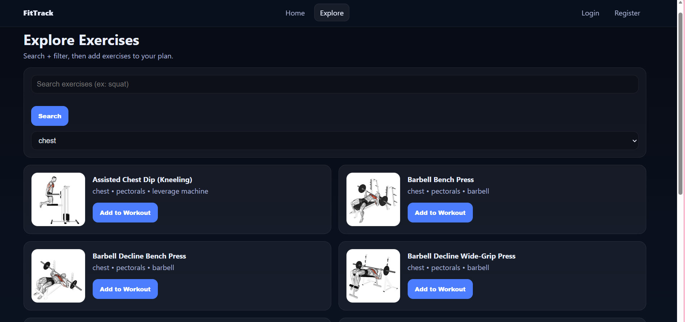

# FitTrack

## Description
FitTrack is a fitness tracker single-page application built with React. It allows users to explore exercises, build workouts, save workouts, log completed workouts, and track their progress over time.

## Purpose
A simple web application built for new gym goers. Provides the necessary features in order to make a simple workout and keep track of previous workouts. 

## Features
- Explore exercises using external API data
- Add exercises to workouts
- Save workouts to your account
- Log completed workouts
- View workout progress
- User authentication with login and registration
- Protected routes for authenticated users
- Responsive design for mobile, tablet, and desktop 

## Tech
- React
- Vite
- React Router DOM
- React Context API
- JavaScript
- CSS
- Vitest
- React Testing Library
- RapidAPI / ExerciseDB API

## Dependencies
Main dependencies:
- react
- react-dom
- react-router-dom

Development dependencies:
- vitest
- jsdom
- @testing-library/react
- @testing-library/jest-dom
- @testing-library/user-event

## Deployment URL
https://fitness-tracker-drab-six.vercel.app/

## Authentication
FitTrack uses a React Context-based authentication system.
- Users can register and log in
- Tokens are stored in sessionStorage
- Logout clears authentication data
- Protected routes prevent unauthenticated access to certain pages

## Testing
- Vitest
- React Testing Library
- Jest DOM

### Run Test
npm test

### Current test coverage includes 
- Authentication context
- Protected routes
- Login validation
- Basic component rendering and interactions

## Future Features 
- Add backend database for real user accounts and persistent storage
- Add advanced workout charts
- Custom profile settings
- Expand testing coverage

## Known Issues
- Exercise images may load inconsistently depending on the API response

## Screenshots




## Setup
```bash
npm install
npm run dev

