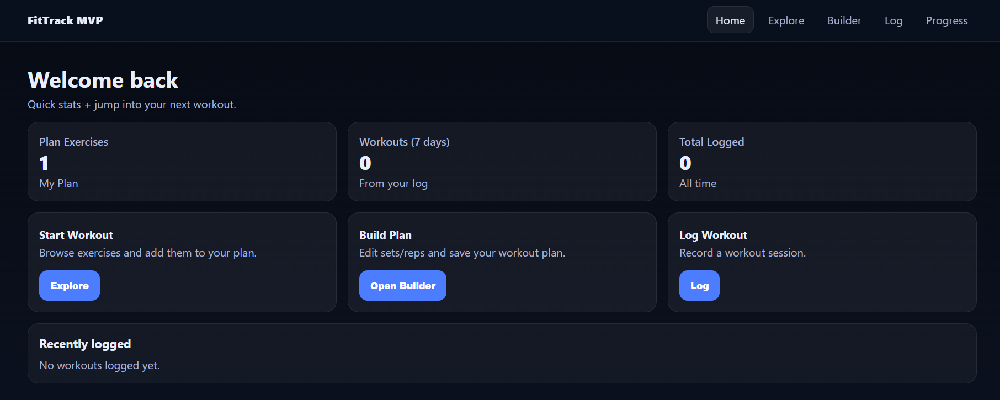
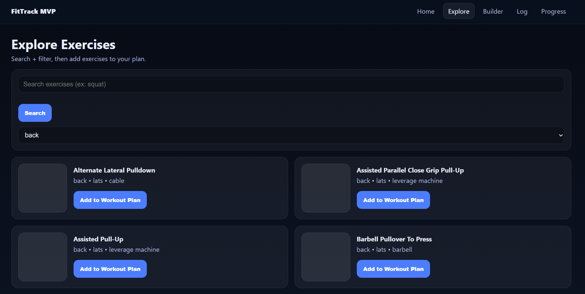
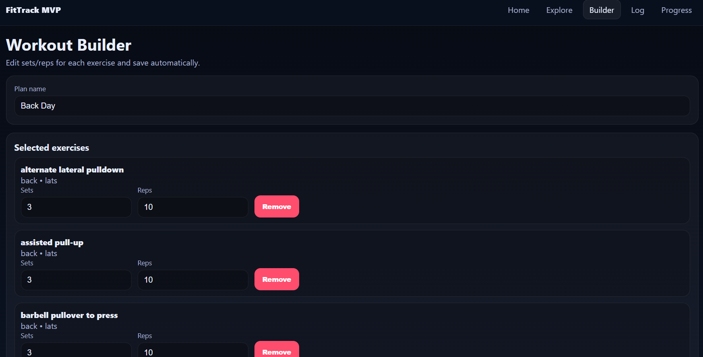
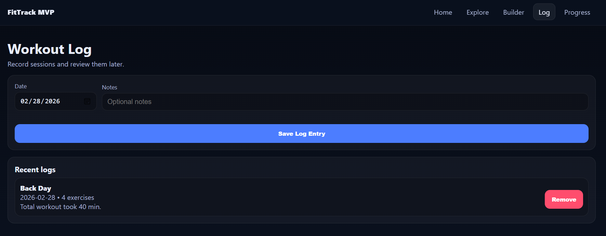
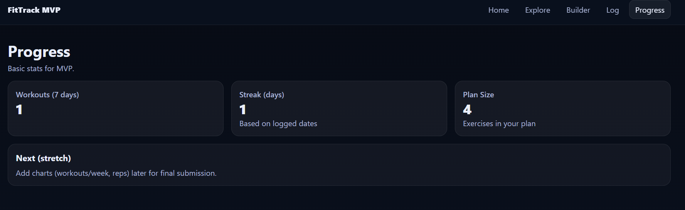

# FitTrack MVP

## Description
A React SPA fitness tracker MVP with Explore (ExerciseDB API), Workout Builder (Context), Logging, and Progress stats. Add exercises from the explore page directly to your current workout in the builder page. Edit each exercide in the builder page and then log workout in the Log page. Your current workout plan will automatically populate in the log page once the "Save Log Entry" button is pressed. 

## Purpose
A simple web application built for new gym goers. Provides the necessary features in order to make a simple workout and keep track of previous workouts. 

## Tech
- React + Vite
- React Router
- Context API
- ExerciseDB (RapidAPI)
- Vitest + React Testing Library
- Vercel (deployment) 

## Deployment URL
https://fitness-tracker-drab-six.vercel.app/

## Future Features 
- Pictures for each exercise, made possible by using a different API
- The ability to add exercise to multiple workouts at a time
- The ability to edit previous workouts that have been logged
- Possibly the ability to add weight used to each exercise in the Builder page

## Known Issues
- There is currently no images for each exercise

## Screenshots






## Setup
```bash
npm install
npm run dev

